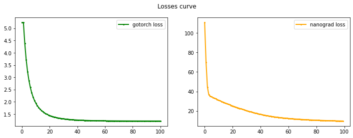

# nanograd
Nanograd: Lightweight automatic differentiation library for Python. Optimize, backpropagate with ease.

## Example
```python
from nanograd.nn import MLP

net = MLP(4, [4, 3, 1])  # A MLP of 4-dim inputs and a total of
# 4 layers of 4,4,3,1 neurons

X = [
    [2.0, 3.0, 5.0, -2.0],
    [-3.0, 1.0, 4.0, -2.0],
    [2.0, 4.0, 5.0, -5.0],
    [1.0, 3.0, 2.0, -1.0]
]
y = [1.0, -1.0, 1.0, -1.0]

# learning loop
lr = 0.05
for e in range(50):
    # forward pass
    yhat = [net(x) for x in X]
    loss = sum((yout - ytrue) ** 2 for yout, ytrue in zip(yhat, y))

    # backward pass
    # zero grad
    net.zero_grad()
    loss.backward()

    # update parameters
    for p in net.parameters():
        p.data += - lr * p.grad

    if e % 5 == 0: print("Epoch ", e, loss.data)

```
## Contributions

Your contributions are very welcome !

You can also check out [gotorch](https://github.com/Godwinh19/gotorch) a neural net env
that I'm writing using Golang.

Here is a losses comparison:



Your can reach me on [twitter](https://twitter.com/GodwinHoudji) or [linkedin](https://www.linkedin.com/in/godwin-houdji) ☕